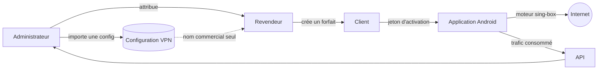

# SXB VPN

Plateforme VPN complète : une application Android à moteur `sing-box` embarqué,
un tableau de bord d'administration multi-rôles avec réseau de revendeurs, et
une API de provisionnement.

**Production :** <https://vpnsxb.afrihall.com>

---

## Ce que fait la plateforme

Un administrateur importe une configuration VPN **une seule fois**. Il la
distribue ensuite à des revendeurs, qui la vendent à leurs propres clients sous
forme de forfaits data. Chaque client active l'application mobile avec un jeton,
consomme son quota, et voit son forfait expirer automatiquement à l'échéance.

Aucun paramètre technique — adresse, port, identifiant, transport — ne quitte
jamais le tableau de bord : ni le revendeur ni le client final n'y ont accès.



---

## Organisation du dépôt

Monorepo **pnpm**. Les paquets sont déclarés dans `pnpm-workspace.yaml`.

| Chemin | Rôle |
| --- | --- |
| `app-mobile/` | Application Android — Expo / React Native 0.81, moteur natif Kotlin |
| `artifacts/sxb-dashboard/` | Tableau de bord d'administration — React 19, Vite, Tailwind |
| `server/` | API Express — routes, middlewares RBAC, services |
| `prisma/` | Schéma PostgreSQL et scripts d'amorçage |
| `backend/prisma/` | **Copie déployée** du schéma — doit rester identique à `prisma/` |
| `lib/` | Bibliothèques partagées (`db`, `api-zod`, `api-client-react`) |
| `.github/workflows/` | Construction Android, déploiement VPS, audit |

> **Attention :** le déploiement pousse `backend/prisma/schema.prisma`, **pas**
> celui de la racine. Une modification faite uniquement à la racine n'atteint
> jamais la base. Un test de régression vérifie que les deux fichiers sont
> identiques.

---

## Application mobile

Le moteur `sing-box` est compilé en bibliothèque native (`libbox.aar`) et
s'exécute **dans le processus de l'application** — il n'y a pas de binaire
externe. Le script `app-mobile/scripts/build-libbox.sh` produit cette
bibliothèque.

**Protocoles pris en charge :** VLESS, VMess, Trojan, Shadowsocks, WireGuard,
Hysteria2, TUIC, et SSH (avec payload).

Points notables du moteur :

- **Résolution DNS d'amorçage** — joindre le serveur exige de résoudre son nom,
  ce qui exigerait le tunnel. Les résolveurs du réseau sont lus via
  `ConnectivityManager` : `address: "local"` échoue sous Android, faute de
  `/etc/resolv.conf`.
- **Empreinte uTLS** — sans elle, le ClientHello émis est celui de Go,
  reconnaissable par les inspections de paquets opérateur.
- **Configurations chiffrées** — la charge est chiffrée en AES avant stockage, la
  clé maître vivant dans le Keystore Android.
- **Compteur de session** — détenu par le service natif, il survit à la mise en
  arrière-plan de l'application.

---

## Tableau de bord et rôles

| Rôle | Portée |
| --- | --- |
| `OWNER` | Tout. Contourne les permissions, met le service en pause, reste invisible des journaux et statistiques des autres rôles. |
| `SUPER_ADMIN` | Administration complète de la plateforme. |
| `ADMIN` | Gestion courante : clients, forfaits, configurations, serveurs. |
| `SUPPORT` | Consultation et assistance. |
| `RESELLER` | **Strictement cloisonné** : ses clients, ses forfaits, son quota, sa propre activité. |

Le revendeur ne voit que les configurations que l'administrateur lui a
explicitement attribuées, et sous leur seul nom commercial. La restriction est
appliquée par l'API, pas seulement par l'affichage : un appel direct avec une
configuration non attribuée reçoit un `403`.

---

## Développement

Prérequis : **Node 22+**, **pnpm**, PostgreSQL.

```bash
pnpm install          # pnpm est obligatoire (un garde-fou refuse npm et yarn)
pnpm run typecheck    # bibliothèques + artifacts
pnpm run build        # typecheck puis construction de chaque paquet
```

Tableau de bord :

```bash
cd artifacts/sxb-dashboard
pnpm run build        # sortie dans dist/public
```

Application mobile :

```bash
cd app-mobile
npx tsc --noEmit                                   # typecheck
npx tsx --test tests/regression-critical-flows.test.ts   # garde-fous
```

Les tests de régression sont des assertions **sur le code source** : ils
verrouillent des décisions dont l'oubli a déjà provoqué des pannes (parité des
schémas Prisma, cloisonnement des rôles, complétude du catalogue pnpm,
découpage du paquet front). Reformuler une ligne assertée casse le test — c'est
voulu.

---

## Déploiement

Trois workflows GitHub Actions :

| Workflow | Déclencheur | Effet |
| --- | --- | --- |
| `deploy-vps.yml` | push sur `main` (chemins surveillés) | Construit puis déploie l'API et le tableau de bord |
| `build-android.yml` | push sur `main` | Construit l'APK signé et publie une release |
| `vps-audit.yml` | manuel | Contrôle l'état du serveur |

Le déploiement ne se déclenche que sur certains chemins : un changement dans
`pnpm-workspace.yaml` ou dans les tests demande un lancement manuel
(`gh workflow run deploy-vps.yml --ref main`).

Le numéro de publication de l'APK est **distinct** du `versionCode` Android : ce
dernier suit `github.run_number` et doit rester strictement croissant, sans quoi
Android refuse d'installer la mise à jour sur les appareils déjà équipés.

### Compte propriétaire

`POST /api/users` refuse de créer un compte `OWNER` si le demandeur n'en est pas
un — le premier ne peut donc naître que hors API :

```bash
OWNER_EMAIL=... OWNER_PASSWORD=... npx tsx prisma/seed-owner.ts
```

Le script est idempotent : le relancer réinitialise le mot de passe, ce qui en
fait aussi la procédure de récupération. Le mot de passe est lu dans
l'environnement, jamais écrit dans le dépôt ni journalisé. Le déploiement
l'exécute automatiquement si les secrets `OWNER_EMAIL` et `OWNER_PASSWORD` sont
définis.

---

## Sécurité

- Les configurations sont chiffrées au repos sur l'appareil, clé maître en
  Keystore Android.
- Les journaux masquent hôtes, identifiants, jetons et UUID.
- L'adresse de sortie n'est ni affichée ni demandée par l'application.
- `minimumReleaseAge` impose un délai d'un jour avant l'installation d'une
  version npm, comme défense contre les compromissions de chaîne
  d'approvisionnement. **Ne pas désactiver.**
