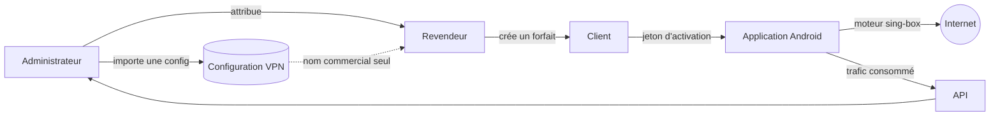

# SXB VPN

Plateforme VPN complète : une application Android à moteur `sing-box` embarqué,
un tableau de bord d'administration multi-rôles avec réseau de revendeurs, et
une API de provisionnement.

**Production :** <https://vpnsxb.afrihall.com>

---

## Ce que fait la plateforme

Un administrateur importe une configuration VPN **une seule fois**. Il la
distribue ensuite à des revendeurs, qui la vendent à leurs propres clients sous
forme de forfaits data. Chaque client active l'application mobile avec un jeton,
consomme son quota, et voit son forfait expirer automatiquement à l'échéance.

Les paramètres techniques ne sont pas affichés aux revendeurs ni aux clients.
L'application reçoit les paramètres nécessaires par le provisionnement chiffré,
uniquement pour l'appareil et le forfait autorisés.



---

## Organisation du dépôt

Monorepo **pnpm**. Les paquets sont déclarés dans `pnpm-workspace.yaml`.

| Chemin | Rôle |
| --- | --- |
| `app-mobile/` | Application Android — Expo / React Native 0.81, moteur natif Kotlin |
| `artifacts/sxb-dashboard/` | Tableau de bord d'administration — React 19, Vite, Tailwind |
| `server/` | API Express — routes, middlewares RBAC, services |
| `prisma/` | Schéma PostgreSQL et scripts d'amorçage |
| `backend/prisma/` | **Copie déployée** du schéma — doit rester identique à `prisma/` |
| `lib/` | Bibliothèques partagées (`db`, `api-zod`, `api-client-react`) |
| `.github/workflows/` | Construction Android, déploiement VPS, audit |

> **Attention :** le déploiement pousse `backend/prisma/schema.prisma`, **pas**
> celui de la racine. Une modification faite uniquement à la racine n'atteint
> jamais la base. Un test de régression vérifie que les deux fichiers sont
> identiques.

---

## Application mobile

Le moteur `sing-box` est compilé en bibliothèque native (`libbox.aar`) et
s'exécute **dans le processus de l'application** — il n'y a pas de binaire
externe. Le script `app-mobile/scripts/build-libbox.sh` produit cette
bibliothèque.

**Protocoles pris en charge :** VLESS, VMess, Trojan, Shadowsocks, WireGuard,
Hysteria2, TUIC, et SSH (avec payload).

Points notables du moteur :

- **Résolution DNS d'amorçage** — joindre le serveur exige de résoudre son nom,
  ce qui exigerait le tunnel. Les résolveurs du réseau sont lus via
  `ConnectivityManager` : `address: "local"` échoue sous Android, faute de
  `/etc/resolv.conf`.
- **Empreinte uTLS** — sans elle, le ClientHello émis est celui de Go,
  reconnaissable par les inspections de paquets opérateur.
- **Configurations chiffrées** — la charge est chiffrée en AES avant stockage, la
  clé maître vivant dans le Keystore Android.
- **Compteur de session** — détenu par le service natif, il survit à la mise en
  arrière-plan de l'application.

---

## Tableau de bord et rôles

| Rôle | Portée |
| --- | --- |
| `OWNER` | Administration racine. Contourne les permissions RBAC, mais pas le verrou par mot de passe des configurations ; peut mettre le service en pause. |
| `SUPER_ADMIN` | Administration complète de la plateforme. |
| `ADMIN` | Gestion courante : clients, forfaits, configurations, serveurs. |
| `SUPPORT` | Consultation et assistance. |
| `RESELLER` | **Strictement cloisonné** : ses clients, ses forfaits, son quota, sa propre activité. |

Le revendeur ne voit que les configurations que l'administrateur lui a
explicitement attribuées, et sous leur seul nom commercial. La restriction est
appliquée par l'API, pas seulement par l'affichage : un appel direct avec une
configuration non attribuée reçoit un `403`.

### Verrouillage des configurations

À la création ou à l'import, un mot de passe de protection **distinct des
identifiants du tunnel VPN** est demandé. La configuration est verrouillée dès
son enregistrement, y compris pour son créateur. Son nom commercial reste
disponible afin de pouvoir l'attribuer, mais ses paramètres techniques et ses
modifications exigent un déverrouillage.

Le verrou s'ajoute aux permissions existantes : connaître le mot de passe ne
donne ni un nouveau rôle ni l'accès aux clients d'un autre revendeur. Aucun
rôle, même `OWNER` ou `SUPER_ADMIN`, ne dispense du déverrouillage. Celui-ci
est temporaire et lié au compte connecté et à la configuration concernée.
Changer le mot de passe invalide les autorisations de déverrouillage précédentes.

Le mot de passe est conservé sous forme de **hash**, jamais en clair. La preuve
temporaire de déverrouillage ne doit être placée ni dans une URL, ni dans les
journaux, ni dans le stockage persistant du navigateur.

L'attribution d'un profil à un client ou à un appareil, puis son provisionnement
dans le mobile, **ne nécessitent pas de déverrouillage**. Les permissions,
la propriété du client, la validité du forfait et les contrôles de quota
continuent de s'appliquer.

Les configurations historiques restent compatibles : la migration ne leur
invente aucun mot de passe et ne coupe pas les appareils déjà provisionnés.
Leur protection peut être activée explicitement depuis le tableau de bord.
Les comptes SSH, Xray et Sing-box liés à un profil doivent respecter le même
verrou ; ils ne constituent pas un accès de remplacement à ses secrets.

### Langues du tableau de bord

Le sélecteur **Français / English** change la langue des écrans, formulaires,
confirmations, états et messages applicatifs. La préférence est conservée dans
le navigateur sous `sxb_vpn_lang`. La langue choisie s'applique aussi aux dates,
nombres et volumes affichés.

Les données saisies par les utilisateurs — noms de clients, noms de profils,
annonces, descriptions, paramètres VPN — ne sont pas traduites ou réécrites.
Les événements historiques des journaux conservent leur contenu d'origine.
Les nouvelles chaînes applicatives doivent avoir une clé dans les deux
dictionnaires, avec les mêmes paramètres d'interpolation `{{parametre}}`.

---

## Développement

Prérequis : **Node 22+**, **pnpm**, PostgreSQL.

```bash
pnpm install          # pnpm est obligatoire (un garde-fou refuse npm et yarn)
pnpm run typecheck    # bibliothèques + artifacts
pnpm run build        # typecheck puis construction de chaque paquet
```

Tableau de bord :

```bash
cd artifacts/sxb-dashboard
pnpm run build        # sortie dans dist/public
```

Application mobile :

```bash
cd app-mobile
npx tsc --noEmit                                   # typecheck
npx tsx --test tests/regression-critical-flows.test.ts   # garde-fous
```

Les tests de régression combinent des assertions sur le code source, des tests
de services et des appels aux véritables routes Express avec une base isolée.
Ils couvrent notamment la parité des schémas Prisma, le cloisonnement des rôles,
les mutations concurrentes et les parcours du dashboard. Les tests de langue
contrôlent les clés et interpolations FR/EN ainsi que les formats affichés.
Ne pas remplacer un test de comportement par la seule présence d'une chaîne
dans le code, ni exécuter les scénarios de mutation sur la base de production.

---

## Déploiement

Trois workflows GitHub Actions :

| Workflow | Déclencheur | Effet |
| --- | --- | --- |
| `deploy-vps.yml` | push sur `main` (chemins surveillés) | Construit puis déploie l'API et le tableau de bord |
| `build-android.yml` | push sur `main` | Construit l'APK signé et publie une release |
| `vps-audit.yml` | manuel | Contrôle l'état du serveur |

Le déploiement ne se déclenche que sur certains chemins : un changement dans
`pnpm-workspace.yaml` ou dans les tests demande un lancement manuel
(`gh workflow run deploy-vps.yml --ref main`).

Le numéro de publication de l'APK est **distinct** du `versionCode` Android : ce
dernier suit `github.run_number` et doit rester strictement croissant, sans quoi
Android refuse d'installer la mise à jour sur les appareils déjà équipés.

### Compte propriétaire

`POST /api/users` refuse de créer un compte `OWNER` si le demandeur n'en est pas
un — le premier ne peut donc naître que hors API :

```bash
OWNER_EMAIL=... OWNER_PASSWORD=... npx tsx prisma/seed-owner.ts
```

Le script est idempotent : le relancer réinitialise le mot de passe, ce qui en
fait aussi la procédure de récupération. Le mot de passe est lu dans
l'environnement, jamais écrit dans le dépôt ni journalisé. Le déploiement
l'exécute automatiquement si les secrets `OWNER_EMAIL` et `OWNER_PASSWORD` sont
définis.

---

## Sécurité

- Les configurations sont chiffrées au repos sur l'appareil, clé maître en
  Keystore Android.
- Les journaux masquent hôtes, identifiants, jetons et UUID.
- L'adresse de sortie n'est ni affichée ni demandée par l'application.
- `minimumReleaseAge` impose un délai d'un jour avant l'installation d'une
  version npm, comme défense contre les compromissions de chaîne
  d'approvisionnement. **Ne pas désactiver.**
